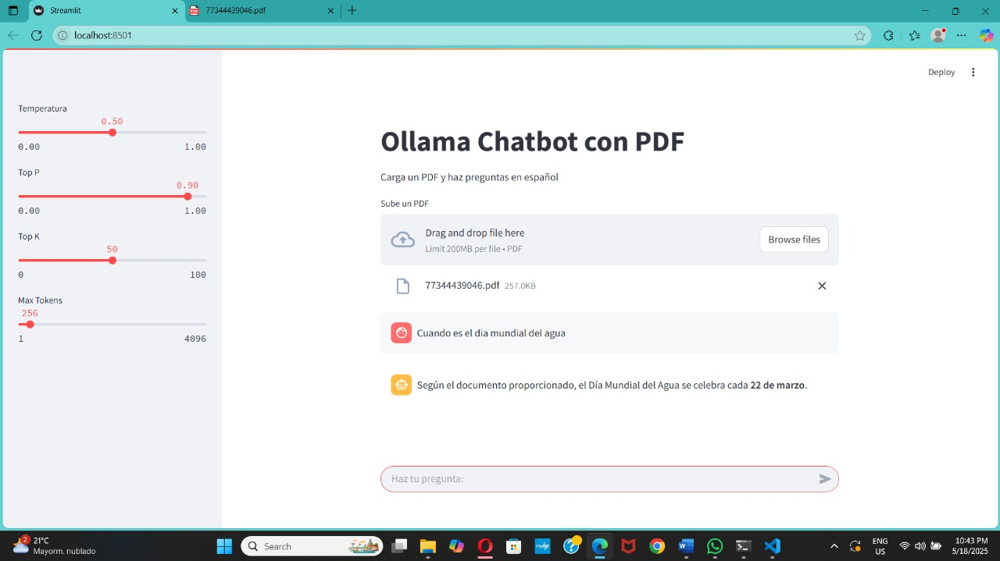
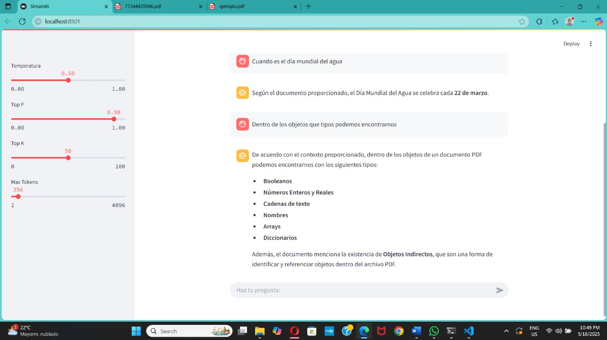

# Instrucciones del proyecto 
Estel proyecto es una interfaz web con Streamlit que permite lecturas de pdfs y realizar preguntas respecto a los pdf suministrados.


### 1. Descargar Ollama y uv
- Ollama - [Download](https://ollama.com/)
- uv - [Terminal](https://docs.astral.sh/uv/#__tabbed_1_1)
> [!IMPORTANT]
> Para correr satisfactoriamente la aplicación y configuración debes contar con UV Python y Ollama (LLMs Open Source).

### 2. Instalar modelo de Ollama: [Llama3](https://ollama.com/library/llama3)
```bash
# Validar Ollama descargado
ollama

# Descargar modelos Llama3
ollama run llama3
```

### 3. Clona el repositorio e instalar dependencias
```bash
git clone https://github.com/ingrid183/Chatbot-PDF
cd Chatbot-PDF

uv add
uv sync
```

### 4. Ejecutar el streamlit
```bash
uv run streamlit run app.py   
```

### 5. Ejemplos de ejecución

#### Ejemplo 1



<br />

#### Ejemplo 2



---

### :busts_in_silhouette: Autor:
- [@ingrid183](https://github.com/ingrid183)
